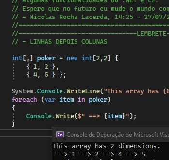

<h1>
Amazon-Intern-Engineer-Test-1/2
</h1>
<h2>Projeto que utilizei para estudar, testando funções, para uma prova para estágio de Desenvolvedor na Amazon. </h2>

<h2>Project that i've used to study, testing functions, for a test for intern developer in Amazon. </h2>

  No teste utilizei C# e Regex

<h3> A parte do C#

  No teste utilizei C# para formular um Array multidimensional (2D, Matriz) e printar os resultados na tela, e apõs isso inverter o subarray e printar os resultados novamente.
</h3>

<h3> A parte do Regex
  Utilizando Regex, criei uma função que escolhe palavras que tenham início e final com a mesma letra.
</h3>

